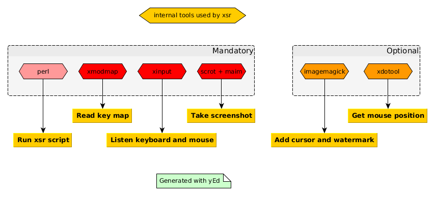
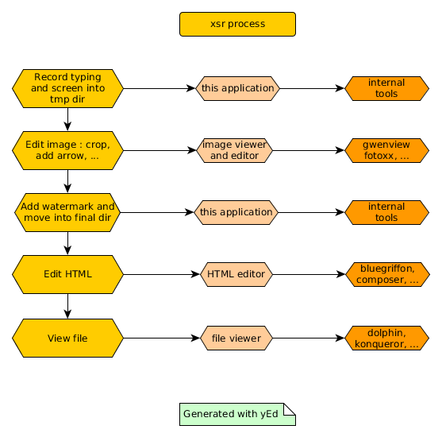
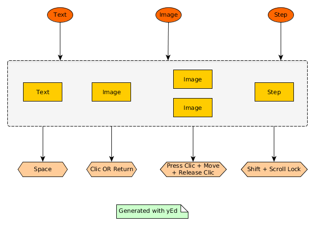
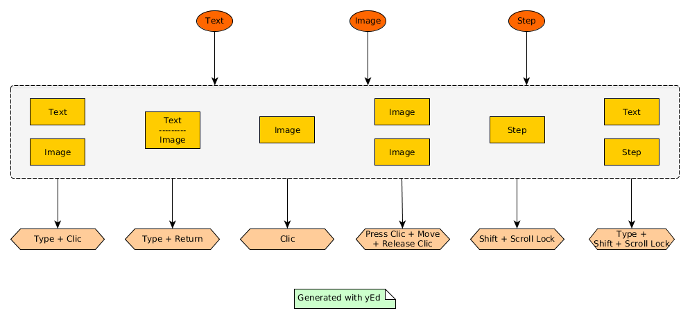
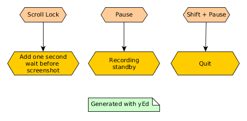

Welcome to 

## Installation

You need all these applications to use XSR :

## How it works ?

## How to interact with XSR ?

With the default mode :

With the typing mode :

Global commands for the two modes :

